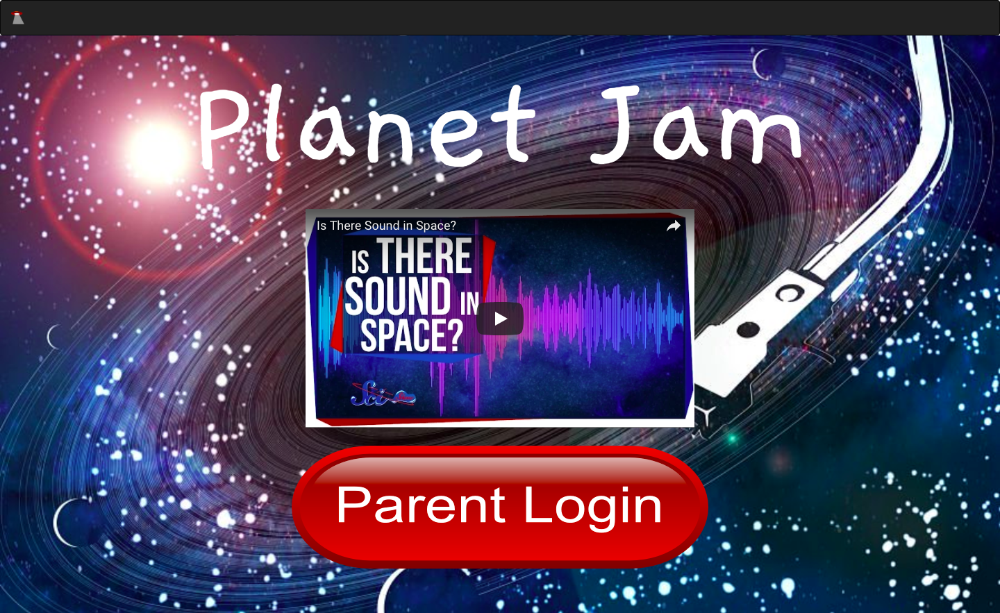
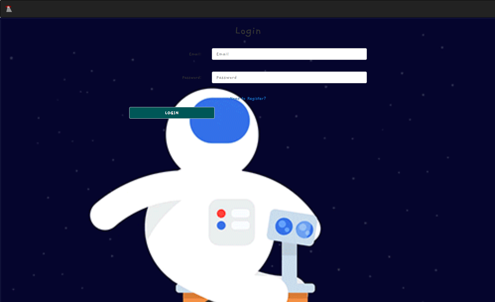
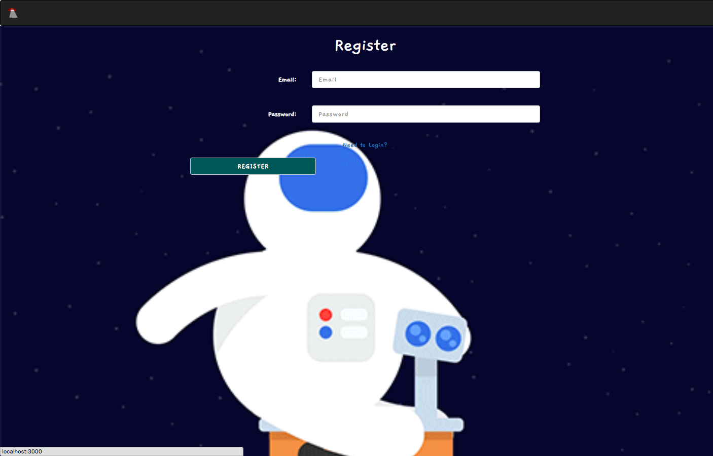
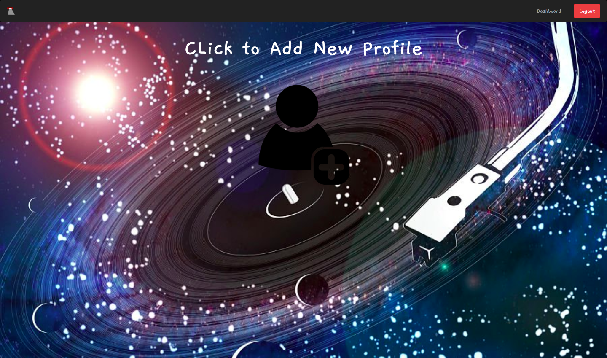
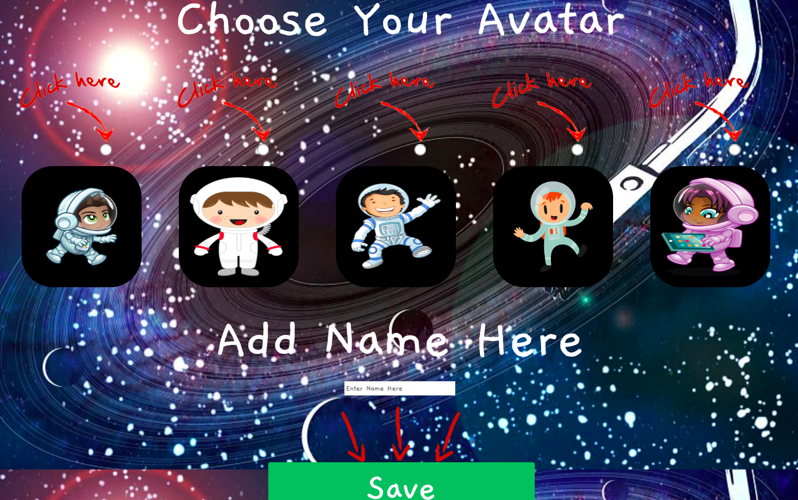
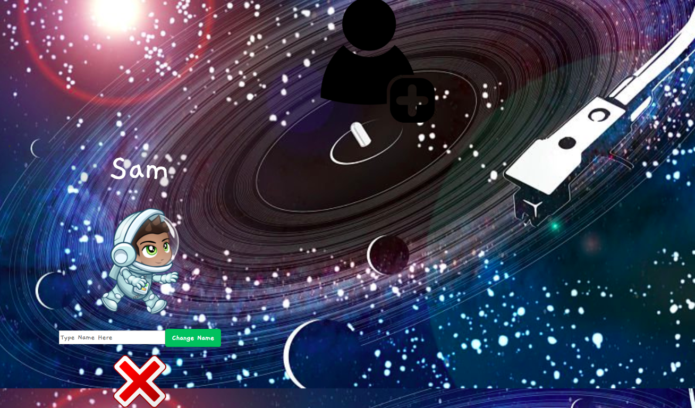
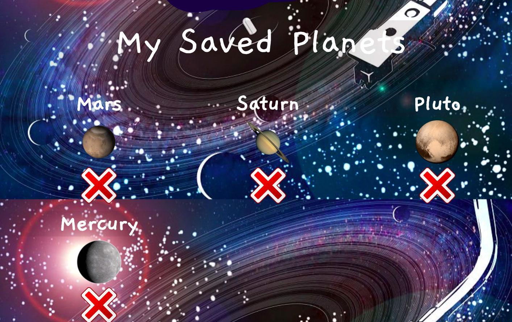
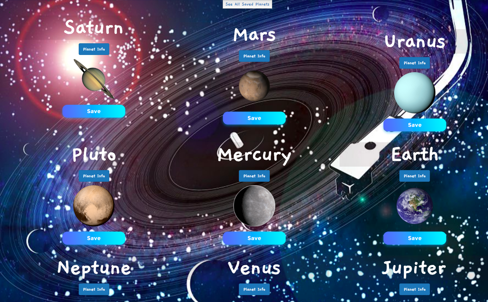
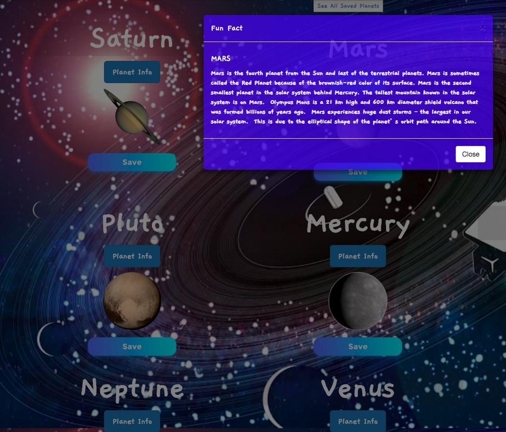

# Planet-Jam

## [DEMO](https://planet-jam-e37a4.firebaseapp.com)

### To help further the education as it regards to space exploration. This app tackles space in a targeted way. Allows children to explore planet sounds and gain additional information in how the sounds are created and researched. With this app you are able to listen to all sounds at one time. There are apps where you can listen individually but not all at once.

## Technology
- HTML
- CSS3
- Sass
- ReactJS
- React Bootstrap
- JavaScript/ES6/JSX
- JQuery
- React 16 / Webpack
- [Firebase](https://firebase.google.com/)
- [react-router-dom](https://reacttraining.com/react-router/core/guides/philosophy)

## Screenshots

The Home page where you can find a short informational video and a link for parent to login/register.

___

The Login page allows user to log in with email and password.

___

The register allows the user to register with email and password for future logins.

___

After you login you will see your dashboard. This dashboard houses your child profiles. If you login in for the fist time no children will show up. You can click on the add person button to create new child.

___

Here you will create your avatar. You will choose your avatar, enter name in input box and click save below.

___

Once created you will see dashboard including your avatar. You can update or delete if you want to change the avatar.

___

Here you will see all saved planets and button to view all planets.

___

Here you can see all planets. play all planet sounds. Click for planet fun fact, and save planets to favorite. There is also a button to view all saved planets.

___

Here is the modal to see funfact for a particular planet.

___

## vol2 Capabilities:
- able to her planet sounds
- Given video to tell user about the information received.
- Save and delete planets.
- Save and delete avatars.
- Update avatar name.

## Future Capabilities
- Update avatar photo.
- Able to mix sounds and save.
- Able to view multiple videos per planet

## Running The Project
1. Clone down this repo and CD into project.
2. Get API keys for Firebase.
3. Copy `src/constants.example.js` to `constants.js` and add the API key.
4. Setup `Firebase` using JSON seed data from `src/db`.
4. Install NPM dependencies by running `npm install` in the root.
5. Initiate `npm start` to spin up a local server.
6. Run `npm run deploy` to deploy project to Firebase.
7. View results: https://planet-jam-e37a4.firebaseapp.com

## Contributors
[Lola Simpson](https://github.com/lolasimp)